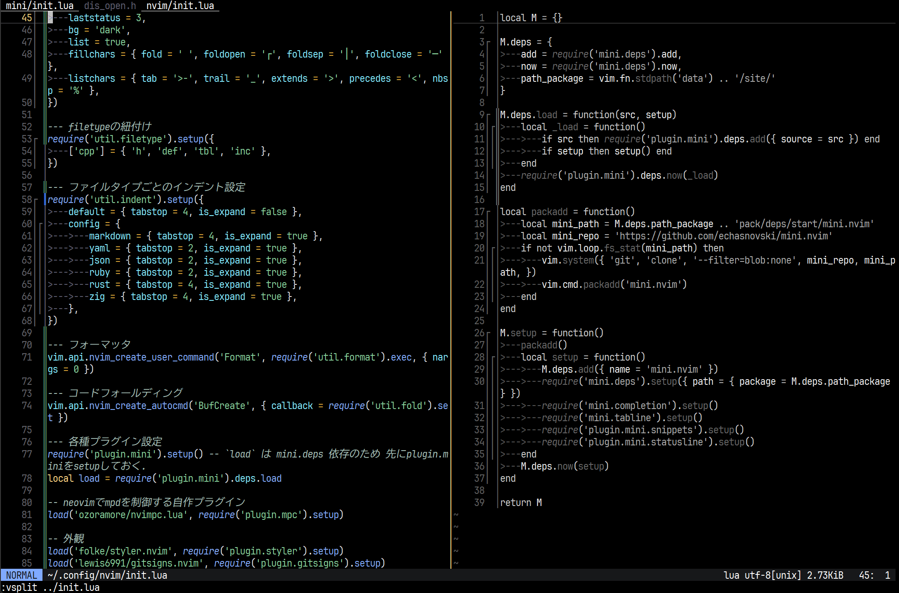

2025-06-06時点.



## 構成

### ディレクトリ構成

<!-- `tree --charset=ascii` -->
```tree
.
|-- colors
|   |-- ombg.lua
|   `-- omfg.lua
|-- init.lua
|-- _init.vim
|-- lua
|   |-- plugin
|   |   |-- dap.lua
|   |   |-- gitsigns.lua
|   |   |-- lsp.lua
|   |   |-- mini
|   |   |   |-- init.lua
|   |   |   |-- snippets.lua
|   |   |   `-- statusline.lua
|   |   |-- mpc.lua
|   |   |-- statuscol.lua
|   |   |-- styler.lua
|   |   `-- treesitter.lua
|   |-- readme.md
|   `-- util
|       |-- fep.lua
|       |-- filetype.lua
|       |-- fold.lua
|       |-- format.lua
|       |-- indent.lua
|       |-- lnum.lua
|       `-- option.lua
|-- README.md
`-- ss.png
```

### プラグイン

名前            |レポジトリ                         |用途
----------------|-----------------------------------|----
mini.nvim       |echasnovski/mini.nvim              |十徳ナイフ。パッケージ管理,Statusline,Snippet,Completionとか色々入っている
nvimpc.lua      |ozoramore/nvimpc.lua               |MPD(music player daemon)の制御,この曲なんだっけの確認
styler.nvim     |folke/styler.nvim                  |`:split` したときに作業中のバッファだけカラフルにする
statuscol.nvim  |luukvbaal/statuscol.nvim           |主にオシャレのため
gitsigns.nvim   |lewis6991/gitsigns.nvim            |変更行の確認に
nvim-dap        |mfussenegger/nvim-dap              |素のgdbは流石に辛いので…
nvim-treesitter |nvim-treesitter/nvim-treesitter    |treesitter管理の効率化
nvim-lspconfig  |neovim/nvim-lspconfig              |各種LSPのデフォルトのconfig
