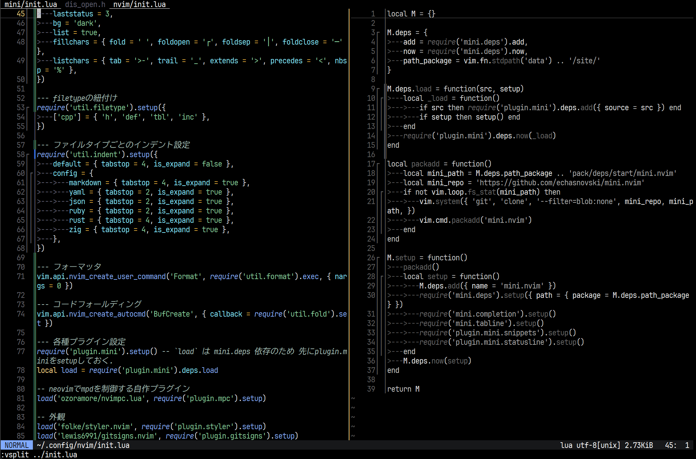

2025-06-06時点.



## 構成

### ディレクトリ構成

<!-- `tree --charset=ascii` -->
```tree
.
|-- colors
|   |-- ombg.lua
|   `-- omfg.lua
|-- init.lua
|-- lua
|   |-- plugin
|   |   |-- dap.lua
|   |   |-- gitsigns.lua
|   |   |-- init.lua
|   |   |-- lnum_color.lua
|   |   |-- lsp.lua
|   |   |-- mini_completion.lua
|   |   |-- mini_deps.lua
|   |   |-- mini_snippets.lua
|   |   |-- mini_statusline.lua
|   |   |-- mini_tabline.lua
|   |   |-- mpc.lua
|   |   |-- statuscol.lua
|   |   |-- styler.lua
|   |   |-- treesitter.lua
|   |   `-- unicode.lua
|   |-- readme.md
|   `-- util
|       |-- bufstr.lua
|       |-- fep.lua
|       |-- file.lua
|       |-- filetype.lua
|       |-- fold.lua
|       |-- format.lua
|       `-- option.lua
|-- README.md
`-- ss.png
```

